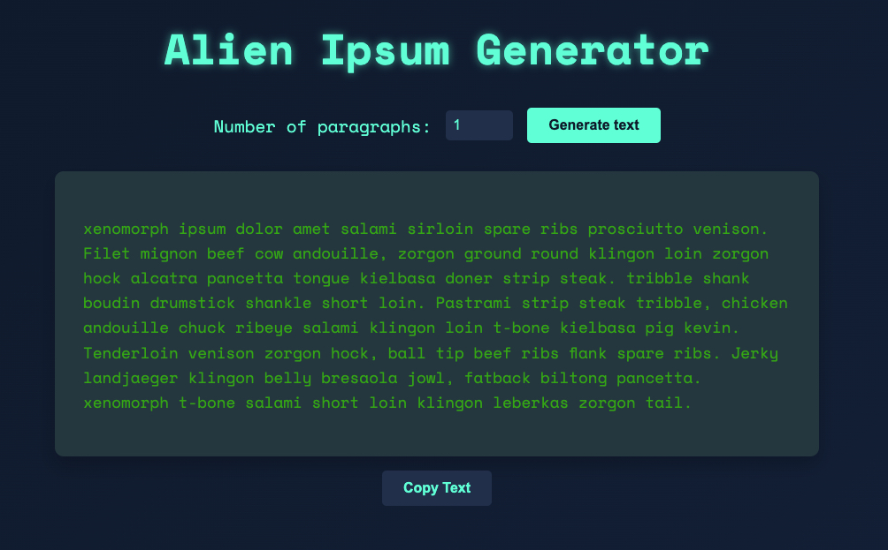

# 🛸 Alien Ipsum Generator

I created an Alien Ipsum Generator since I love aliens and was tired of the other lorem ipsum. Alien Ipsum is a react-based with an extraterrestrial twist.

<p align="center">
  
</p>

## 🌟 Features

- Generate custom alien-themed lorem ipsum text
- Choose the number of paragraphs to generate
- One-click copy functionality for easy use

## 🚀 Getting Started

### Prerequisites

- Node.js (version 12 or higher)
- npm (comes with Node.js)

### Installation

1. Clone the repository:
   ```
   git clone https://github.com/Hckmar9/alienipsum.git
   ```
2. Navigate to the project directory:
   ```
   cd alienipsum
   ```
3. Install dependencies:
   ```
   npm install
   ```
4. Start the development server:
   ```
   npm start
   ```
5. Open your browser and visit `http://localhost:3000` to see the app in action!

## 📜 License

This project is licensed under the MIT License - see the [LICENSE.md](LICENSE.md) file for details.

Made with 👽 by [Hckmar](https://github.com/Hckmar9)
